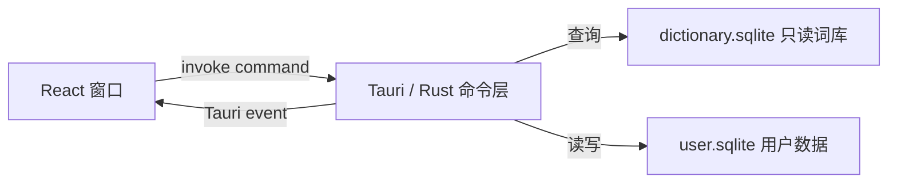

# 简词

一个离线优先、无广告的中英桌面词典，面向 macOS 与 Windows。

本项目使用 **Tauri 2** 封装桌面应用，并非 Electron。开发时由 Vite 提供前端页面，Tauri 使用系统 WebView 显示页面，同时由 Rust 处理 SQLite、窗口控制和本地数据。发布后不需要浏览器或单独运行前端服务器。

## 当前功能

- 英文查询：IPA 音标、按词性分组的中文释义
- 中文词语查询：相关英文单词或短语
- 输入联想（不计入统计）与确认查询计数
- 管理窗口显示最近 20 条查询，后台永久保留查询事件
- 按次数排序的查询统计
- 可自定义、多重归类的收藏夹
- 可记忆的窗口置顶设置
- 独立的只读词库数据库和用户数据库

仓库包含由 FreeDict English–Chinese 数据生成的离线 SQLite 词库。目前收录约 24,560 个英文词条，并生成约 17,766 个中文到相关英文词条的反向索引。

## 技术栈

### 桌面运行时

- **Tauri 2**：创建 macOS/Windows 原生窗口、管理多窗口、窗口置顶和前后端命令调用。
- **系统 WebView**：macOS 使用 WKWebView，Windows 使用 WebView2，不随应用捆绑完整 Chromium。
- **Rust 2021**：实现桌面入口、业务命令、数据库访问和持久化。

### 前端

- **React 19**：主窗口、管理窗口及弹窗组件。
- **TypeScript 5.8**：前后端传输对象和组件状态的静态类型。
- **Vite 6**：开发服务器和前端生产构建。
- **原生 CSS**：应用主题、响应式布局和窗口级样式，没有引入 UI 组件库。
- **`@tauri-apps/api`**：调用 Rust command，并监听窗口之间的 Tauri event。

### 数据层

- **SQLite**：词库和用户数据均存储在本地文件中。
- **Rusqlite**：Rust SQLite 驱动，启用 `bundled` 特性，随应用编译 SQLite，减少系统版本差异。
- **Serde / Serde JSON**：Rust 数据结构序列化为前端可用的 JSON。
- **Reqwest / Ed25519 / SHA-256 / zstd**：通过 HTTPS 获取词库，验证签名与哈希，并解压更新包。

## 系统架构

应用分为前端视图层、Tauri 命令层和本地数据层：



前端不会直接访问数据库。所有输入校验、查询排序、历史计数、收藏关系和设置写入均在 Rust 命令层完成。

### 窗口结构

- **主窗口 `main`**：标题栏统计/置顶图标、搜索、候选词和词条详情。
- **管理窗口 `management`**：最近 20 条查询、查询统计和收藏夹两个页签。
- 管理窗口点击统计或收藏词条时，Rust 聚焦主窗口并发送 `open-entry` 事件。
- 已经打开的管理窗口会被复用，通过 `select-tab` 事件切换页签，不重复创建窗口。

### 查询数据流

1. 用户输入内容，前端在 150ms 防抖后调用 `search_entries` 获取前缀候选；该操作不计入统计。
2. 用户按 Enter 或选择候选，前端调用 `get_entry` 加载完整词条。
3. 成功打开词条后调用 `record_query`。
4. Rust 在同一事务中写入 `query_events`，并更新 `query_stats` 聚合计数。
5. 管理窗口读取最近 20 条记录，并按查询次数和最近时间排序统计数据。

### Rust 命令边界

- 查询：`search_entries`、`get_entry`
- 历史与统计：`record_query`、`get_recent_queries`、`get_query_stats`
- 收藏夹：创建、重命名、删除收藏夹，以及添加、移除、读取收藏关系
- 设置：`get_settings`、`set_always_on_top`
- 窗口：`open_management_window`、`focus_main_window`
- 元数据：`dictionary_metadata`
- 词库更新：`check_dictionary_update`、`install_dictionary_update`

命令实现集中在 `src-tauri/src/lib.rs`，前端封装集中在 `src/api.ts`。前端组件不散落使用字符串形式的 command 名称。

## 目录结构

```text
.
├── src/                         # React / TypeScript 前端
│   ├── MainWindow.tsx           # 查词主窗口
│   ├── ManagementWindow.tsx     # 统计与收藏管理窗口
│   ├── api.ts                   # Tauri command 客户端封装
│   ├── types.ts                 # 前端领域类型
│   ├── components/              # 词条、收藏弹窗和图标组件
│   └── hooks/                   # 通用 React hooks
├── src-tauri/
│   ├── src/lib.rs               # Rust 命令、SQLite schema 与窗口管理
│   ├── src/main.rs              # Tauri 二进制入口
│   ├── src/dictionary_seed.sql  # 完整资源缺失时的开发回退词库
│   ├── resources/               # 完整 SQLite 词库及数据许可证
│   ├── capabilities/            # Tauri 窗口权限
│   └── tauri.conf.json          # 应用窗口、构建与打包配置
├── package.json
└── vite.config.ts
```

## 开发

需要 Node.js 22.5+、Rust stable，以及对应平台的 Tauri 系统依赖。词库构建脚本使用 Node.js 内置的 `node:sqlite`。

```bash
npm install
npm run tauri dev
```

常用命令的区别：

- `npm run tauri dev`：启动完整桌面应用。它会自动运行 Vite，并编译/启动 Rust 后端。
- `npm run dev`：只启动 Vite 前端服务器，主要用于前端资源调试，不会创建桌面窗口。
- `npm run build`：只执行 TypeScript 检查并生成前端静态文件，不会启动应用。
- `npm run tauri build`：构建可分发的桌面应用和安装包。

只检查前端：

```bash
npm run build
```

Rust 测试：

```bash
cargo test --manifest-path src-tauri/Cargo.toml
```

完整 Rust 编译检查：

```bash
cargo check --manifest-path src-tauri/Cargo.toml
```

运行词库解析和前端组件测试：

```bash
npm test
```

提交到 GitHub 后，CI 会在 macOS 和 Windows 上分别执行前端测试、Rust 测试、格式检查和无安装包的 Tauri 调试构建。

macOS 打包产物默认位于：

```text
src-tauri/target/release/bundle/macos/简词.app
src-tauri/target/release/bundle/dmg/
```

## 本地数据

首次启动后会在系统应用数据目录创建：

- `dictionary.sqlite`：词典数据，运行时只读
- `user.sqlite`：查询事件、聚合统计、收藏夹和设置

两者相互独立，因此替换词库不会清除用户数据。收藏条目会保留词头快照；若更新后的词库缺少对应稳定 ID，界面会标记为“词库中暂不可用”。

### 数据表职责

`dictionary.sqlite`：

- `entries`：词头、语言、IPA、拼音、简繁体及来源。
- `senses`：按词性归组的释义。
- `entry_search`：精确和前缀查询使用的标准化搜索项。
- `dictionary_metadata`：词库版本、构建信息、来源和许可证。

`user.sqlite`：

- `query_events`：每一次成功确认查询的永久事件记录。
- `query_stats`：按词条维护的查询次数和最近查询时间。
- `favorite_folders`：用户自定义收藏夹。
- `favorite_entries`：词条与收藏夹的多对多关系及词头快照。
- `app_settings`：当前保存窗口置顶设置。

用户数据库启用 WAL 和外键约束。查询事件与聚合统计在一个事务内更新，避免两份数据不一致。schema 使用 SQLite `PRAGMA user_version` 逐版本迁移；应用不会通过删除 `user.sqlite` 来升级结构。

应用标识已由旧的 `com.plaindictionary.app` 调整为 `com.plaindictionary.desktop`。首次以新版本启动时会迁移旧应用数据目录，已有历史、收藏和设置不会因此丢失。

## 词库生产流程

完整词库在发布构建之前生成，应用启动时不会解析 StarDict、XML 或 JSONL。当前构建命令为：

```bash
npm run dictionary:build
```

该命令下载并校验固定版本的 FreeDict English–Chinese StarDict 包，结构化解析 IPA、词性和中文翻译，然后生成：

```text
src-tauri/resources/dictionary.sqlite
src-tauri/resources/licenses/FreeDict-eng-zho-COPYING.txt
```

当前处理流程：

1. 下载 FreeDict English–Chinese 固定版本，并验证 SHA-512。
2. 解析 StarDict 索引和 HTML 词条，仅提取英文词头、首个 IPA、词性和中文翻译。
3. 将英文词头标准化为小写，并按词性合并、去重中文释义。
4. 根据中文翻译生成“中文词语 → 相关英文词”的反向索引。
5. 生成与 `src-tauri/src/lib.rs` schema 一致的 SQLite 文件并执行完整性优化。
6. 将原始许可证随词库一起打包；应用启动时先复制并校验新词库，再通过备份和原子重命名替换旧版本。安装失败时恢复备份，且始终不修改用户数据库。

词条 ID 保持确定性：英文使用 `en:{normalized_headword}`，中文反向索引使用 `zh:{headword}`。词库更新不得使用自增 ID，以免破坏历史和收藏关联。

## 数据许可

- FreeDict：各词典的具体许可随数据发布，打包前必须核对对应 TEI 元数据。
- 当前 FreeDict English–Chinese / WikDict 数据：CC BY-SA 3.0 Unported，完整文本随应用打包。
- 上游数据来自 Wiktionary，并由 DBnary、WikDict 和 FreeDict 处理发布；具体署名见词库元数据与随附许可证。

应用内“关于词库与许可”会展示词库构建时写入的元数据。再分发完整或派生词库时，必须保留署名、许可证文本及相同方式共享要求。

## 发布状态

本地 macOS 调试 DMG 可通过以下命令构建：

```bash
npm run tauri build -- --debug --bundles dmg
```

公开分发前仍需配置 Apple Developer 签名与公证，并在真实 Windows runner 或 Windows 设备上验证安装包、窗口层级和 WebView2 行为。仓库中的 CI 已覆盖 Windows 编译路径，但只有推送到 GitHub 并成功运行后才能视为 Windows 验证完成。

## 在线词库更新

“关于词库与许可”中的更新按钮只在用户主动点击时联网。更新流程会验证 Ed25519 清单签名、压缩包大小、SHA-256、词库内部版本和 SQLite 完整性，然后使用备份与原子替换安装；任一步失败都继续保留旧词库。

应用构建时必须注入稳定清单 URL 和 Ed25519 公钥：

```bash
export PLAIN_DICTIONARY_UPDATE_MANIFEST_URL="https://github.com/OWNER/REPOSITORY/releases/download/dictionary-latest/dictionary-manifest.json"
export PLAIN_DICTIONARY_UPDATE_PUBLIC_KEY="BASE64编码的32字节Ed25519公钥"
npm run tauri build
```

未设置这两个变量时应用仍可正常离线使用，但更新界面会显示“未配置可信更新源”。公钥会编译进应用，私钥绝不能放入仓库或随应用分发。

### 发布词库

先在仓库外生成 Ed25519 私钥：

```bash
openssl genpkey -algorithm Ed25519 -out ~/dictionary-private.pem
npm run dictionary:release -- --repository OWNER/REPOSITORY --key ~/dictionary-private.pem
```

该命令需要系统中存在 `zstd`，会在 `.release/` 生成：

- `dictionary.sqlite.zst`
- `dictionary-manifest.json`
- `public-key.txt`，其内容用于 `PLAIN_DICTIONARY_UPDATE_PUBLIC_KEY`

GitHub 仓库 Secret `DICTIONARY_PRIVATE_KEY` 保存私钥 PEM 全文后，可以手动运行 `Publish dictionary` workflow。它会创建不可变的 `dictionary-{version}` Release，并更新 `dictionary-latest` Release 中的稳定清单。清单中的下载地址仍指向具体版本，因此更新过程可追溯且不会被同名文件静默覆盖。
